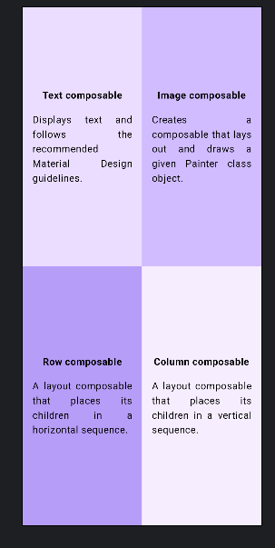

# Compose Quadrant Layout

This is a simple Android application built using Jetpack Compose that demonstrates how to create a quadrant layout. It showcases the use of various composables such as `Column`, `Row`, and `Box` in a responsive layout.

## Features

- Displays a quadrant layout using a combination of `Row` and `Column` composables.
- Each quadrant contains a card with a title and description.
- Demonstrates the use of color and layout alignment in Jetpack Compose.

## Screenshots




## Installation

To run this project locally, follow these steps:

1. Clone this repository:

   ```bash
   git clone https://github.com/nxteai/Compose-Quadrant-Layout.git
